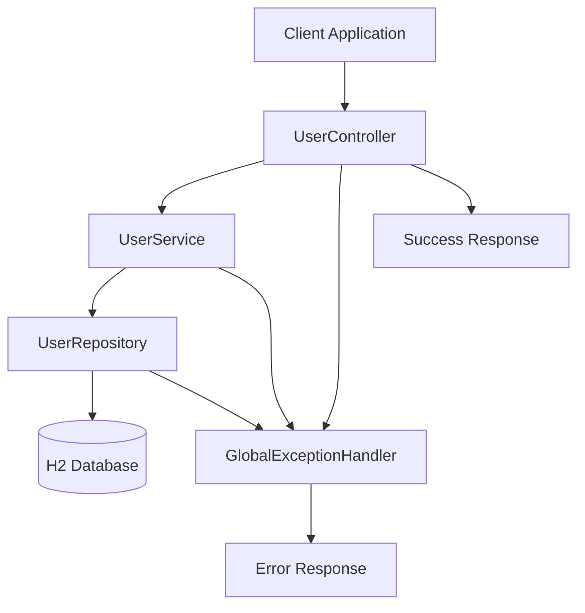
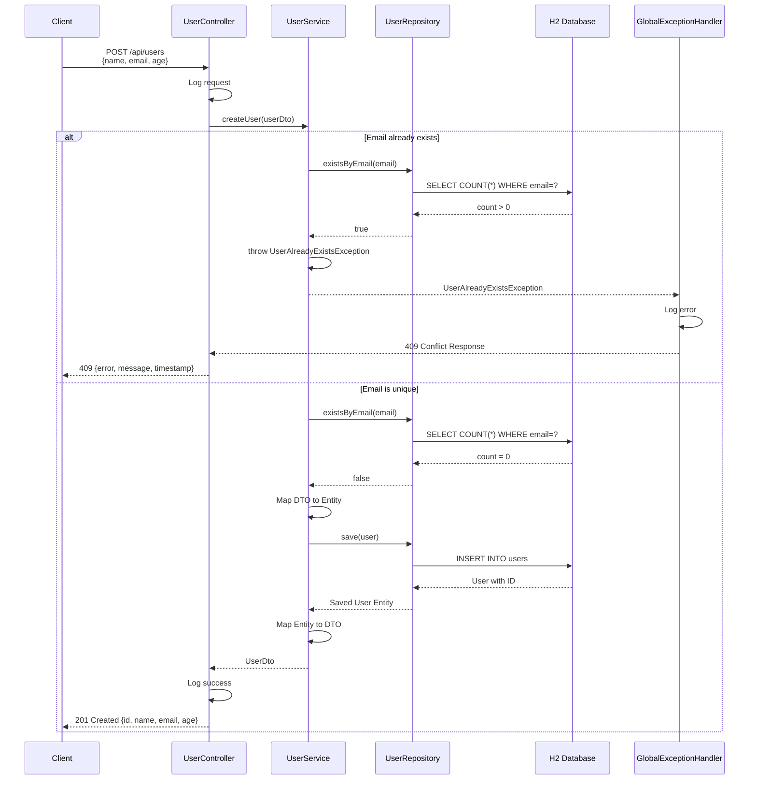
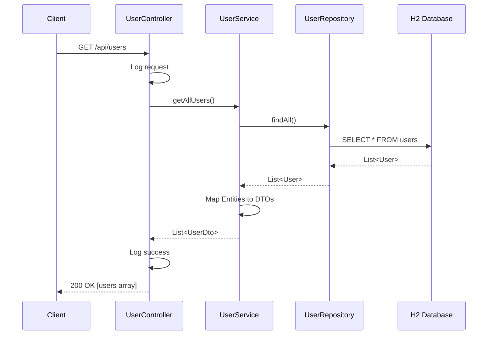
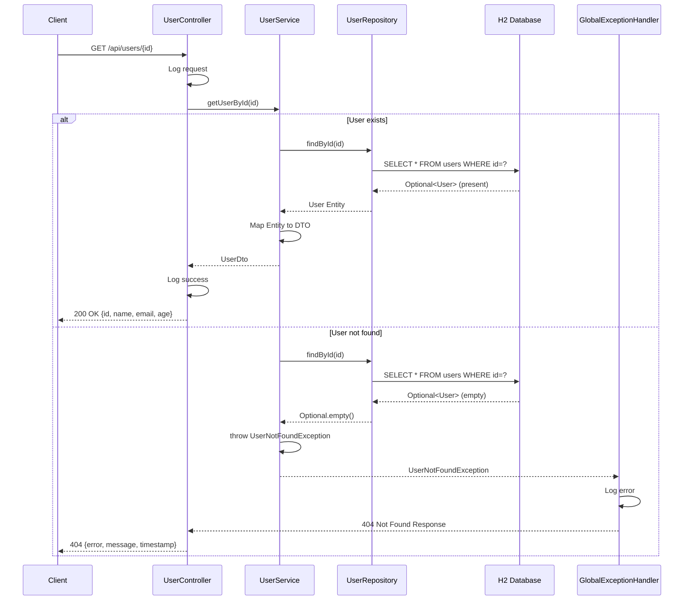
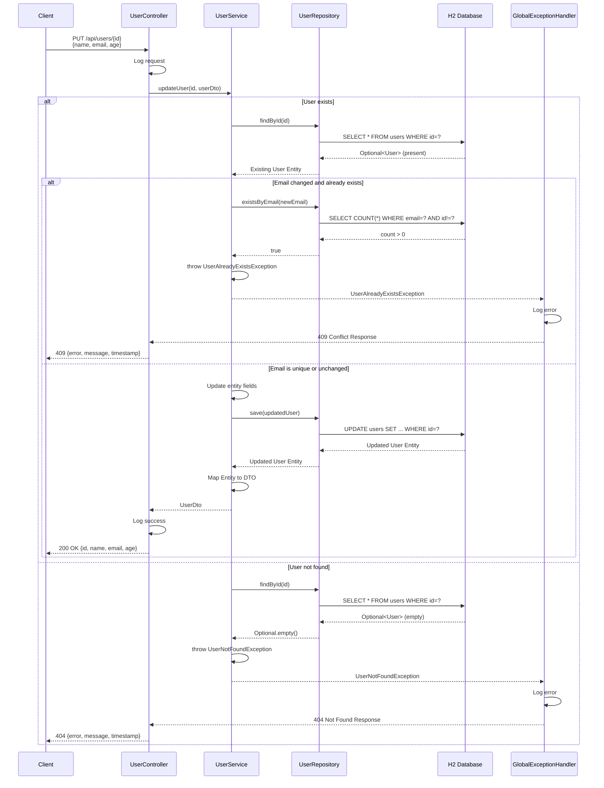
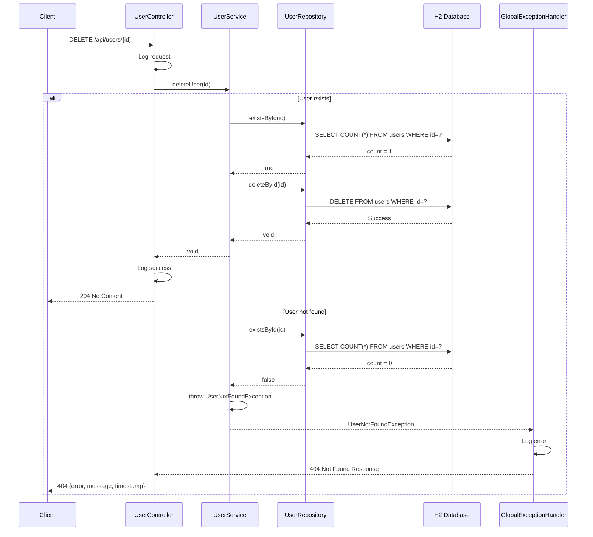
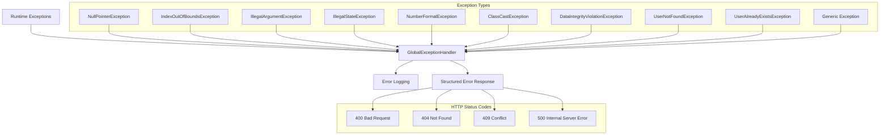
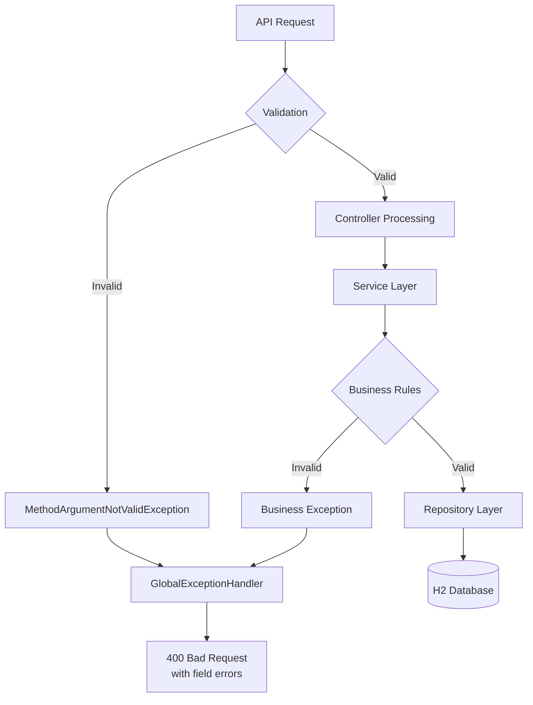

# API Flow Diagram - User Management CRUD Operations

This document provides comprehensive flow diagrams for all User Management APIs, showing the complete request-response flow through the application layers.

## Overall Architecture Flow



## 1. Create User API - POST /api/users



## 2. Get All Users API - GET /api/users



## 3. Get User by ID API - GET /api/users/{id}



## 4. Update User API - PUT /api/users/{id}



## 5. Delete User API - DELETE /api/users/{id}



## Exception Handling Flow



## Data Validation Flow



## API Response Formats

### Success Responses

```json
// Create User (201 Created)
{
  "id": 1,
  "name": "John Doe",
  "email": "john@example.com",
  "age": 30
}

// Get All Users (200 OK)
[
  {
    "id": 1,
    "name": "John Doe",
    "email": "john@example.com",
    "age": 30
  }
]

// Delete User (204 No Content)
// Empty response body
```

### Error Responses

```json
// User Not Found (404)
{
  "timestamp": "2025-06-08T21:46:00.323",
  "status": 404,
  "error": "User Not Found",
  "message": "User not found with ID: 1"
}

// User Already Exists (409)
{
  "timestamp": "2025-06-08T21:46:00.323",
  "status": 409,
  "error": "User Already Exists",
  "message": "User with email john@example.com already exists"
}

// Validation Error (400)
{
  "timestamp": "2025-06-08T21:46:00.323",
  "status": 400,
  "error": "Validation Failed",
  "message": "Invalid input data",
  "validationErrors": {
    "email": "Email is required",
    "age": "Age must be greater than 0"
  }
}
```

## Performance Considerations

- **Database Connections**: H2 in-memory database for fast operations
- **Transaction Management**: `@Transactional` annotations for data consistency
- **Logging**: Strategic logging at INFO/WARN/ERROR levels (max 7 per request)
- **Exception Handling**: Centralized error handling for consistent responses
- **Validation**: Early validation to prevent unnecessary processing

## Security Considerations

- **Input Validation**: Bean validation annotations on DTOs
- **SQL Injection Prevention**: JPA/Hibernate parameterized queries
- **Error Information**: Sanitized error messages to prevent information leakage
- **Exception Logging**: Detailed logging for debugging without exposing sensitive data
