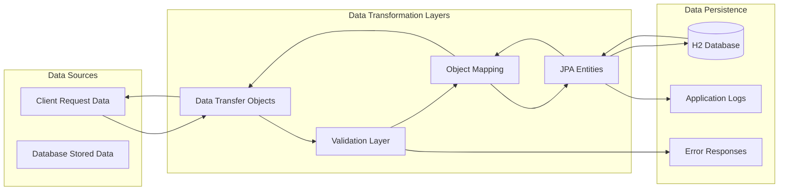
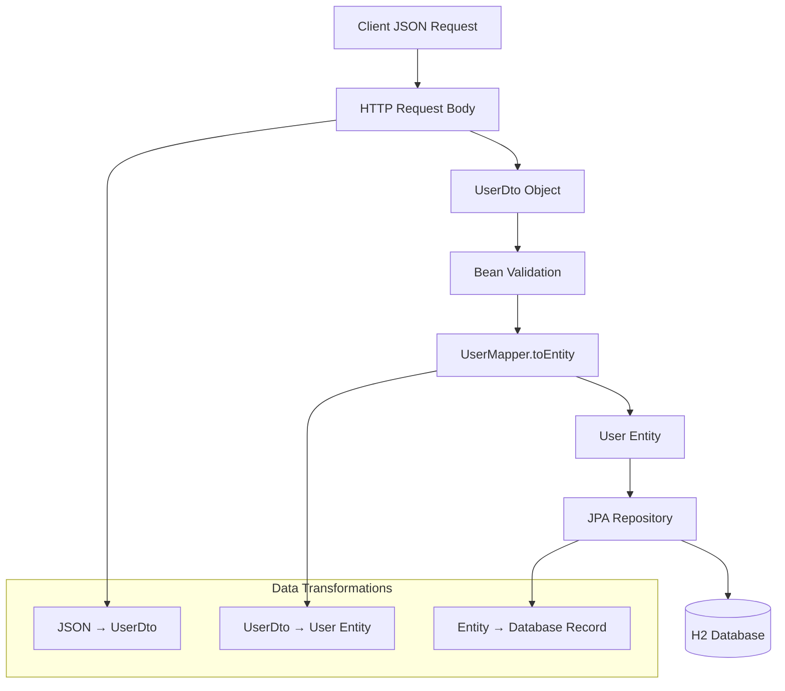
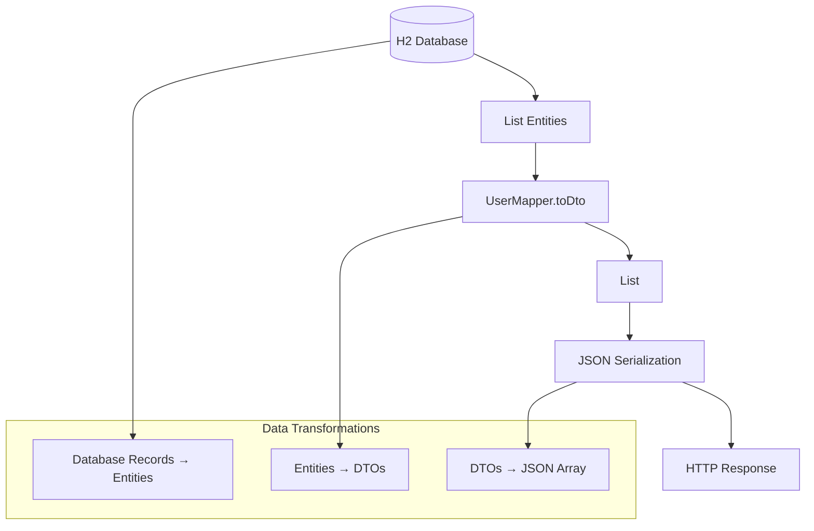
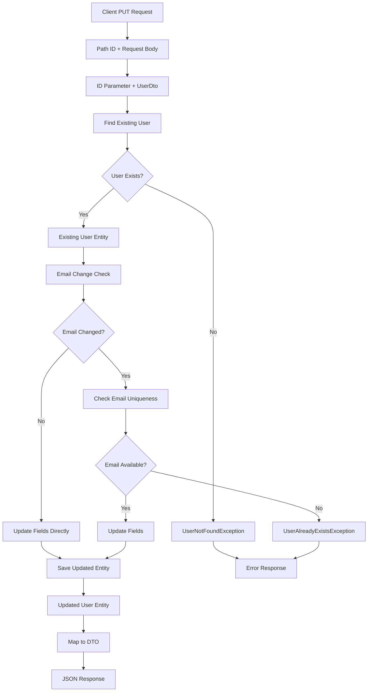
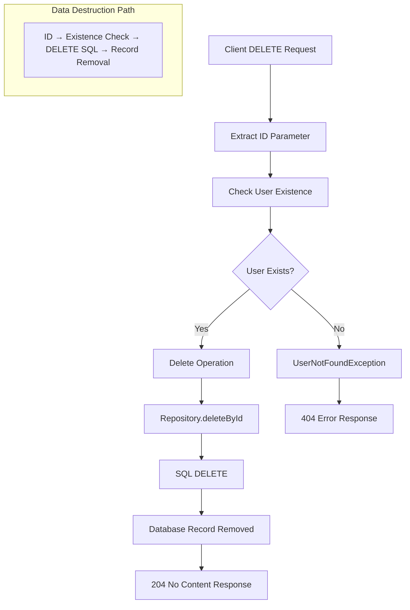
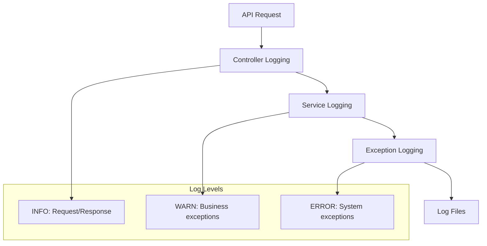
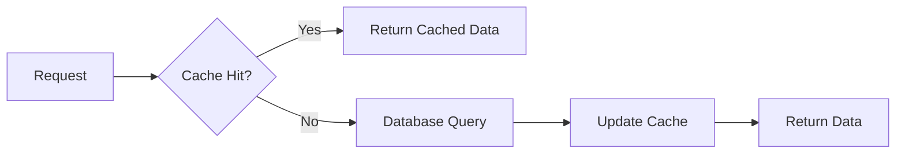

# API Lineage Mapping - User Management System

This document provides comprehensive data lineage mapping for all User Management APIs, showing how data flows, transforms, and persists through the entire system lifecycle.

## Data Lineage Overview



## 1. CREATE USER API - Data Lineage

### Input Data Flow


### Data Lineage Trace
| Stage | Data Format | Fields | Validation | Transformation |
|-------|-------------|--------|------------|----------------|
| 1. Client Input | JSON | `{name, email, age}` | HTTP Content-Type | String → JSON |
| 2. Controller | UserDto | `name, email, age` | @Valid annotation | JSON → Object |
| 3. Service Layer | UserDto | `name, email, age` | Business rules | DTO validation |
| 4. Mapping Layer | User Entity | `id=null, name, email, age` | JPA annotations | DTO → Entity |
| 5. Repository | User Entity | `id=null, name, email, age` | Database constraints | Entity → SQL |
| 6. Database | Table Record | `id=generated, name, email, age` | DB constraints | SQL INSERT |
| 7. Response | User Entity | `id=generated, name, email, age` | - | DB → Entity |
| 8. Mapping | UserDto | `id, name, email, age` | - | Entity → DTO |
| 9. Controller | JSON | `{id, name, email, age}` | - | DTO → JSON |

### Data Audit Trail
```sql
-- Database lineage for CREATE operation
INSERT INTO users (name, email, age) VALUES (?, ?, ?)
-- Generated: id = AUTO_INCREMENT
-- Constraints: email UNIQUE, age > 0, name NOT NULL
```

## 2. GET ALL USERS API - Data Lineage

### Output Data Flow


### Data Lineage Trace
| Stage | Data Format | Source | Transformation | Output |
|-------|-------------|--------|----------------|--------|
| 1. Repository Query | SQL | `SELECT * FROM users` | DB → ResultSet | Raw data |
| 2. JPA Mapping | List<User> | ResultSet | ResultSet → Entities | Object collection |
| 3. Service Processing | List<User> | Repository | Business logic | Validated entities |
| 4. Object Mapping | List<UserDto> | Entities | Entity → DTO | Transfer objects |
| 5. JSON Serialization | JSON Array | DTOs | Object → JSON | Response format |
| 6. HTTP Response | JSON | Controller | JSON → HTTP | Client response |

## 3. GET USER BY ID API - Data Lineage

### Data Flow with Error Handling
```mermaid
graph TD
    A[Client Request /api/users/{id}] --> B[Path Variable Extraction]
    B --> C[Long ID Parameter]
    C --> D[Repository.findById]
    D --> E{User Exists?}
    
    E -->|Yes| F[Optional<User> Present]
    E -->|No| G[Optional<User> Empty]
    
    F --> H[User Entity]
    G --> I[UserNotFoundException]
    
    H --> J[UserMapper.toDto]
    I --> K[GlobalExceptionHandler]
    
    J --> L[UserDto Response]
    K --> M[Error Response JSON]
    
    subgraph "Success Path"
        N[DB Record → Entity → DTO → JSON]
    end
    
    subgraph "Error Path"
        O[Empty Result → Exception → Error JSON]
    end
```

### Data Lineage Trace
| Stage | Success Path | Error Path | Data Format |
|-------|-------------|------------|-------------|
| 1. Input | `id` parameter | `id` parameter | Long |
| 2. Repository | `findById(id)` | `findById(id)` | SQL Query |
| 3. Database | Record found | No record | Optional<User> |
| 4. Service | User entity | Exception thrown | Entity/Exception |
| 5. Mapping | DTO conversion | Error handling | UserDto/ErrorResponse |
| 6. Response | 200 + UserDto JSON | 404 + Error JSON | JSON |

## 4. UPDATE USER API - Data Lineage

### Complex Data Flow with Validation


### Data Lineage Trace
| Stage | Data Source | Validation | Transformation | Persistence |
|-------|-------------|------------|----------------|-------------|
| 1. Input | Client JSON + Path ID | HTTP validation | JSON → DTO + Long | Memory |
| 2. Lookup | Database query | ID exists check | SQL → Entity | Memory |
| 3. Validation | Current vs New data | Business rules | Field comparison | Memory |
| 4. Email Check | Database query | Uniqueness constraint | SQL COUNT query | Memory |
| 5. Update | Merged data | Entity validation | DTO fields → Entity | Memory |
| 6. Persistence | Updated entity | JPA constraints | Entity → SQL UPDATE | Database |
| 7. Response | Saved entity | - | Entity → DTO → JSON | HTTP |

### Data Audit Trail
```sql
-- Database lineage for UPDATE operation
SELECT * FROM users WHERE id = ?           -- Existence check
SELECT COUNT(*) FROM users WHERE email = ? AND id != ?  -- Uniqueness check
UPDATE users SET name = ?, email = ?, age = ? WHERE id = ?  -- Update operation
```

## 5. DELETE USER API - Data Lineage

### Deletion Data Flow


### Data Lineage Trace
| Stage | Data Flow | Validation | Action | Result |
|-------|-----------|------------|--------|--------|
| 1. Input | ID parameter | Path variable validation | Extract Long ID | Memory |
| 2. Existence Check | Database query | Record exists | SQL EXISTS query | Boolean |
| 3. Deletion | Database operation | Referential integrity | SQL DELETE | Record removed |
| 4. Response | Empty body | - | HTTP 204 | Client confirmation |

### Data Audit Trail
```sql
-- Database lineage for DELETE operation
SELECT COUNT(*) FROM users WHERE id = ?  -- Existence check
DELETE FROM users WHERE id = ?           -- Deletion operation
-- Result: Record permanently removed from database
```

## Cross-API Data Dependencies

### Data Relationship Matrix
| Operation | Reads From | Writes To | Validates Against | Affects |
|-----------|------------|-----------|-------------------|---------|
| CREATE | Request body | users table | email uniqueness | New record |
| GET ALL | users table | Response | - | Read-only |
| GET BY ID | users table | Response | ID existence | Read-only |
| UPDATE | Request body + users table | users table | ID existence + email uniqueness | Existing record |
| DELETE | Path parameter | users table | ID existence | Record removal |

### Data Consistency Rules
1. **Email Uniqueness**: Enforced across CREATE and UPDATE operations
2. **ID Existence**: Validated in GET BY ID, UPDATE, and DELETE operations
3. **Data Integrity**: JPA constraints ensure valid data at all times
4. **Transaction Boundaries**: Each operation is atomic

## Data Transformation Mapping

### UserDto ↔ User Entity Mapping
```java
// Forward mapping (DTO → Entity)
UserDto → User Entity
{
    name: String → name: String
    email: String → email: String  
    age: Integer → age: Integer
    id: Long → id: Long (null for CREATE)
}

// Reverse mapping (Entity → DTO)
User Entity → UserDto
{
    id: Long → id: Long
    name: String → name: String
    email: String → email: String
    age: Integer → age: Integer
}
```

### Database Schema Mapping
```sql
-- Table: users
CREATE TABLE users (
    id BIGINT GENERATED BY DEFAULT AS IDENTITY PRIMARY KEY,
    name VARCHAR(255) NOT NULL,
    email VARCHAR(255) NOT NULL UNIQUE,
    age INTEGER NOT NULL CHECK (age >= 1)
);

-- Indexes for performance
CREATE UNIQUE INDEX idx_users_email ON users(email);
CREATE INDEX idx_users_id ON users(id);
```

## Data Quality and Validation Lineage

### Validation Pipeline
```mermaid
graph LR
    A[Raw Input] --> B[HTTP Validation]
    B --> C[Bean Validation]
    C --> D[Business Validation]
    D --> E[Database Constraints]
    E --> F[Validated Data]
    
    subgraph "Validation Layers"
        G[@Valid annotations]
        H[Custom business rules]
        I[JPA constraints]
    end
    
    C --> G
    D --> H
    E --> I
```

### Data Quality Rules
| Field | Validation Rule | Layer | Error Response |
|-------|----------------|-------|----------------|
| name | Not null, not empty | Bean Validation | 400 Bad Request |
| email | Not null, valid format, unique | Bean + Business | 400/409 |
| age | Not null, >= 1 | Bean Validation | 400 Bad Request |
| id | Valid Long format | Path Variable | 400 Bad Request |

## Logging and Audit Lineage

### Log Data Flow


### Audit Trail Components
1. **Request Logging**: HTTP method, endpoint, parameters
2. **Business Logic Logging**: User operations, validation results
3. **Error Logging**: Exception details, stack traces
4. **Performance Logging**: Operation timing, database queries

## Data Security and Privacy Lineage

### Sensitive Data Handling
| Data Element | Sensitivity | Protection | Logging Policy |
|--------------|-------------|------------|----------------|
| User ID | Low | None required | Full logging |
| Name | Medium | Input validation | Masked in errors |
| Email | High | Uniqueness validation | Masked in errors |
| Age | Low | Range validation | Full logging |

### Data Flow Security
- **Input Sanitization**: Bean validation prevents malicious input
- **SQL Injection Prevention**: JPA parameterized queries
- **Error Information**: Sanitized error messages prevent data leakage
- **Logging Security**: Sensitive data masked in log outputs

## Performance and Optimization Lineage

### Query Performance Tracking
```sql
-- Performance-optimized queries
SELECT * FROM users WHERE id = ?           -- Primary key lookup (O(1))
SELECT * FROM users WHERE email = ?        -- Unique index lookup (O(log n))
SELECT * FROM users                        -- Full table scan (O(n))
```

### Caching Strategy (Future Enhancement)


This comprehensive lineage mapping provides complete traceability of data flow through all API operations, enabling effective debugging, compliance, and optimization efforts.
